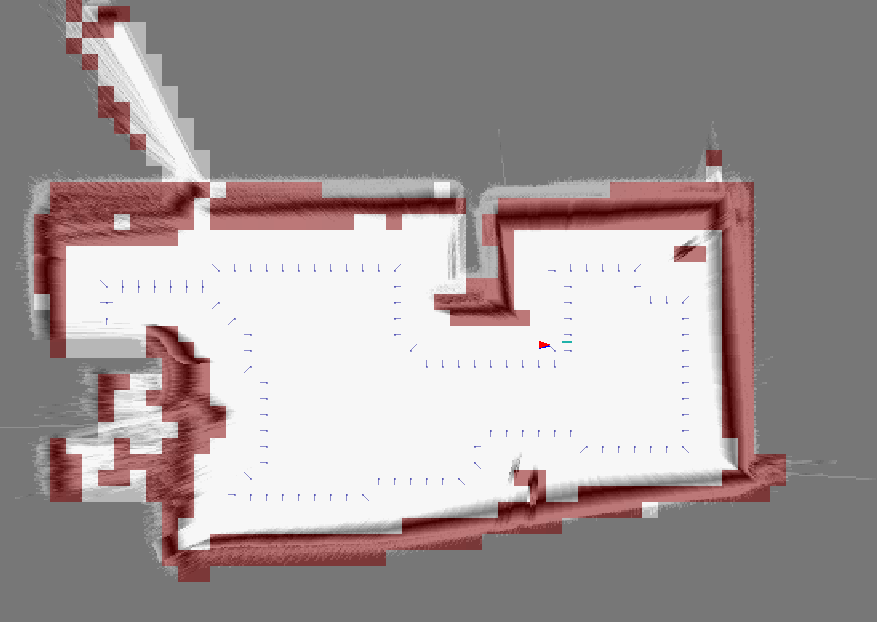

# SLAM.NET

Simultaneous Localization And Mapping (SLAM) libraries for C#

Here are two C# SLAM implementations: CoreSLAM and HectorSLAM. Both use base classes from BaseSLAM library.

## CoreSLAM

This is based on the CoreSLAM algorithm by Bruno Steux, Oussama El Hamzaoui (I can't find an authentic link to it...).
The Monte-carlo search function has been looked from some other C and C++ implementations but I did differently.
First of all there's always fixed number of iterations to get stable speed.
Additionally the search is done on multiple threads to get maximum performance on multi-core platform.
It also uses [Redzen](https://www.nuget.org/packages/Redzen) fast normal distribution random number generator.

I used it in my [Robotex](https://robotex.international) 2019 robotic competition robot "Ace Ventura" and won the "Starship animal rescure" competition so it kind of works.
It runs on Raspberry Pi 4 with .NET Core 3.0 pretty well, there's some CPU time left over for other tasks as well.
To speed it up even further it should be possible to use ARM SIMD instruction set NEON, if .NET Core devs implement ARM intrinsics.

Here's picture of my robots view. The grayscale is the CoreSLAM hole map. The red overlay is objects - they are detected slightly differently, but the code is in the same C# library.

The problem is with this SLAM algorithm that it's heavily dependent on odometry and even with odometry the map tilts and slides over time.

## HectorSLAM

This is the attempt to port [HectorSLAM](https://github.com/tu-darmstadt-ros-pkg/hector_slam) algorithm from C++ to C#.
HectorSLAM is a ROS package and based on what I've read and seen it looks much more stable than CoreSLAM.
Since I'm not very fond of C++ boilerplate code (getters and setters) I started porting it and actually it went much smaller in lines of code.
However this is very-very raw and doesn't work. I've just manage to make something compile, but many things are commented out.
I wanted to use .NET Core System.Numerics namespace, but it doesn't have 3x3 matrixes and other helper functions which are in Eigen C++ library what the HectorSLAM uses.

Anyway, maybe somebody wants to use them.

----

*PS.*

You can get the RPLidar A1 C# code from [here](https://github.com/mikkleini/rplidar.net). To do path planning, you can use my fork of [Roy-T AStar]( https://github.com/mikkleini/AStar). The master AStar library is now very different and due to lack of agent size wouldn't fit.
