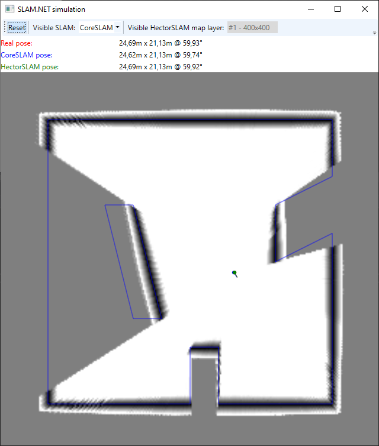
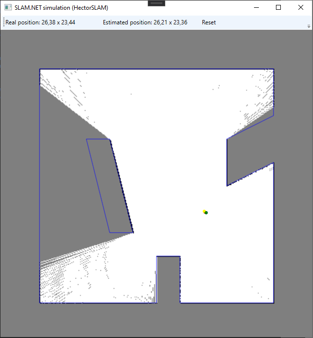

# SLAM.NET

Here are two C# Simultaneous Localization And Mapping (SLAM) implementations currently:
 * CoreSLAM
 * HectorSLAM

Both share types and functionality from BaseSLAM library.

This project grew out from a competition robot development where I used 2D laser scanner for navigation and C# .NET Core on Raspberry Pi Rasbian OS. The original algorithms are written in other languages by other people, I just rewrote them in C# and improved their performance to get lowest possible latency from lidar scan to position estimate. Main gain comes from parallelization of some parts of the algorithms. Not everything is parallelizable though.

The project contains a simulation application which makes algorithms porting and tuning much simpler than using a real robot. That simulation application was actually the reason to make the code a bit more portable and flexible. So you can use the libraries here even when you don't have the actual robot hardware.

I hope this project helps developing robots in C#.

## CoreSLAM

This is based on the CoreSLAM algorithm by Bruno Steux, Oussama El Hamzaoui. [See here](https://www.researchgate.net/publication/228374722_CoreSLAM_a_SLAM_Algorithm_in_less_than_200_lines_of_C_code).
The article doesn't contain actual Monte-Carlo search algorithm. Most implementations I found, refined the search location several times, which means the search iteration count varies, but I wanted to get steady loop times on robot, so I sticked with fixed number of search iterations. It can be chosen through CoreSLAMProcessor constuctor argument.

Performance increase comes from using the CoreSLAM "distance" calculation algoritm from several threads. It's straightforward - all threads search for best position and the best of each thread will eventually be the final position estimate. [Redzen](https://www.nuget.org/packages/Redzen) fast normal distribution random number generator is used and to further minimize latency from scan to localisation, the random numbers are pre-buffered for each scan by the same threads which do the search. .NET Parallel namespace functionality isn't used here because due to threads spawning overhead or something, it didn't work as well as when re-using same old threads.

I used CoreSLAM in my [Robotex](https://robotex.international) 2019 robotic competition robot "Ace Ventura" and won the "Starship animal rescure" competition, so it kind of works. My problem with CoreSLAM was that even with wheel odometry the map tilted and shifted over time, mostly just a little bit, but sometimes a lot.

Here's the picture of the CoreSLAM functioning in simulation:

The grayscale map is the hole map. The darker the color, the "deeper" the hole. The blurrier the hole, the "wider" the hole. See simulator chapter for further explanation.

## HectorSLAM

This is the port of [HectorSLAM](https://github.com/tu-darmstadt-ros-pkg/hector_slam) algorithm from C++ to C#.
HectorSLAM is originally a ROS package and based on what I've read and seen it looks much more stable than CoreSLAM.
At first it seemed to be big job to get it over to C#, but there was a lot of C++ boilerplate code, some dead code and debug code, so in the end it got much smaller and understandable. ROS package used Eigen library which I switched over to .NET System.Numerics, so there are no external dependencies. One minor disadvantage: .NET doesn't have 3x3 matrixes so 4x4 matrixes are used.

In the simulator it works fine as long as the linear and angular movement speeds are slow.
Linear movement speed per lidar scan has to be less than the physical pixels size of coarsest map.
E.g. if the resolution is 0.05m, map size is 400x400, map levels is 3, scan rate is 7 scans/sec then max speed must be:
  (400 * 0.05m) / 23 => 2.5 m/scan => 0,35 m/s.
When this speed is exceeded, the algorithm loses the position and doesn't recover.
I haven't calculated the maximum angular movement speed. It would require understanding inner logic of the algorithm a bit more. But it is not very large either, based on testing it seems to be around 20 degrees per scan cycle.

Here's the picture of the HectorSLAM functioning in simulation:

## Simulator

A few words about simulator also. It is a WPF application which use [Box2D](https://github.com/benukhanov/box2d-netstandard) physics engine for 2D lidar ray distance measurement.

At one time either CoreSLAM or HectorSLAM map can be viewed. HectorSLAM uses several layers, so there's sub-option to pick one of them.
Regardless of what view it is, both SLAM algorithms execute in parallel. Blue walls on top of the map show the real walls.

Dots and small lines show the poses. (Pose = position + direction). Dot is the position and line is the direction.
Color coding of poses and values on toolbar:
 * Red - Real pose 
 * Blue - CoreSLAM pose
 * Green - HectorSLAM pose

Lidar pose can be changed with mouse:
 * Left click to change position (X and Y).
 * Right click to change direction (Z).

To simulate real movement, rather than "jump" from point to point, drag the mouse cursor by holding left button down.
To rotate (change direction) slowly, click right mouse button far away from the dot.
Mouse wheel zooms the map in and out. It is easier to move maximizing window and zooming in.

When pose estimator loses it's real location, click "Reset" button on the top left toolbar. It is very easy to lose the location in simulator by click too far, but keep in mind that the simulator area is 40x40m, so it would have to be quite fast robot which would actually make such a big leap in real life.

The size of the area, scan rate, etc. are all constants, constructor arguments or properties in the MainWindow code which can be changed and tried when rebuilding the application.

*PS.*

You can get the RPLidar A1 C# code from [here](https://github.com/mikkleini/rplidar.net). To do path planning, you can use my fork of [Roy-T AStar]( https://github.com/mikkleini/AStar). The master AStar library is now very different and due to lack of agent size wouldn't fit.
